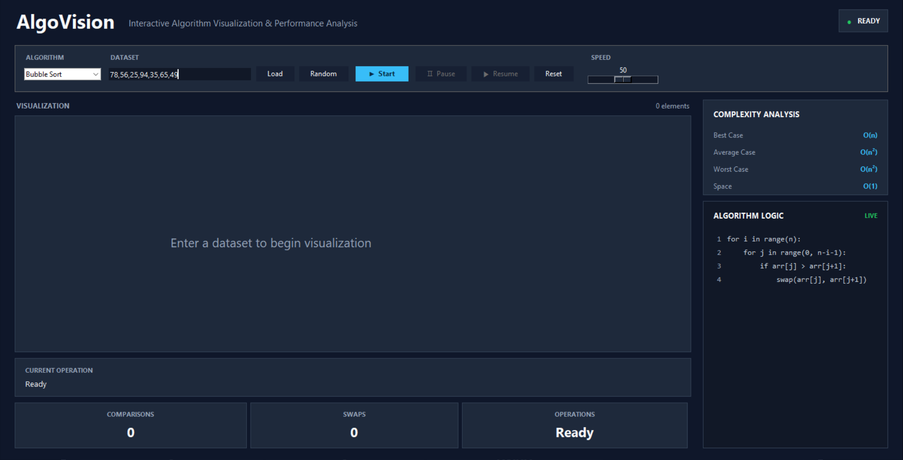
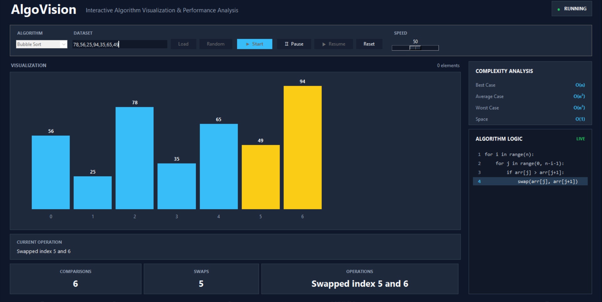
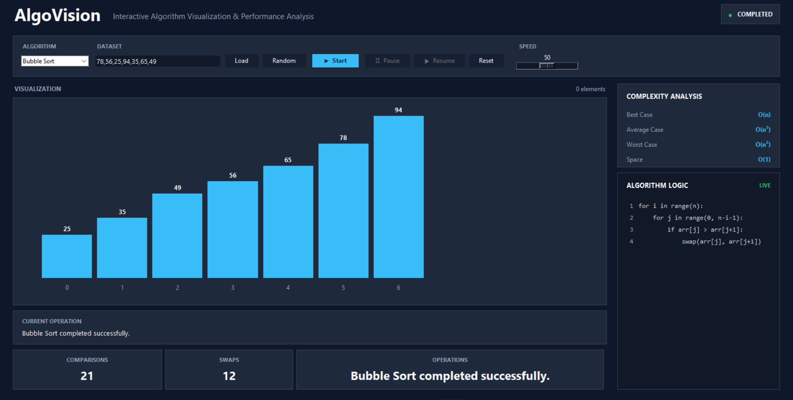

🚀 Built AlgoVision — Interactive Algorithm Visualization & Performance Analysis

I’m excited to share my Python project AlgoVision, an interactive tool that visualizes sorting algorithms through animation and real-time performance metrics.

🔹 Algorithms implemented:
• Bubble Sort
• Selection Sort
• Insertion Sort

🔹 Key Features:
• Animated sorting visualization
• Custom & random datasets
• Live comparison, swap & operation counts
• Real-time code highlighting
• Time & space complexity analysis
• Adjustable speed
• Pause & Resume functionality
• Clean dark-themed GUI

🛠️ Tech Stack: Python | Tkinter | Algorithms

This project helped me strengthen my understanding of data structures, algorithms, time complexity, GUI development, and Python programming.

🔗 GitHub: [keep your GitHub preview/link here]

#Python #PythonProject #Algorithms #DataStructures #Tkinter #AlgorithmVisualization #GitHub #Programming #LearningByBuilding## 📸 Screenshots

### Dashboard

### Sorting in Progress

### Sorting Completed

